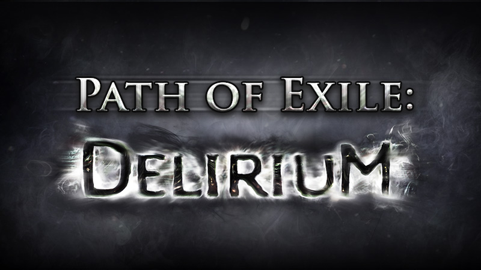

# How popular is this ascendancy

### Quick look at the most popular ascendancies of the last challenge league on Path of Exile - Delirium

[Link to colab](https://colab.research.google.com/drive/1650y40rFd9Jbb0jOARthdWLXU9sQEvUf#scrollTo=A2P-v-X6pGKW)

There are 4 different leagues in a single challenge league :
- Softcore(SC): the default league without any modifiers
- Hardcore(HC): a league with no modifies but has permanent death. Characters that die with be moved to a seperate server called Standard. 
- Solo-self Found(SSF): A league with no interactions with other players. This means there is no trading allowed and you can only use items that you have found yourself.
  - Within SSF, there is also a softcore and hardcore version.

[More info on the leagues](https://pathofexile.gamepedia.com/League)

This project will be looking at the top 2000 players of each league

Between the 4 leagues, this shows how many of each class was chosen

Within the 7 classes, each class has 3 ascendancies besides Scion, who only has 1

Just by a quick look, the most popular ascendancy would be the Guardian.

Now let's look at how they were spread throughout their respective leagues.

 

 

From this we can tell that Guardian is favored within the trade leagues and not the solo self found leagues.

While going through the data, it clearly depicts that the favored class of Delirium is Templar and the favored Ascendancy is Guardian. 
